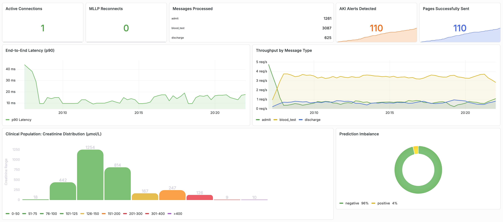
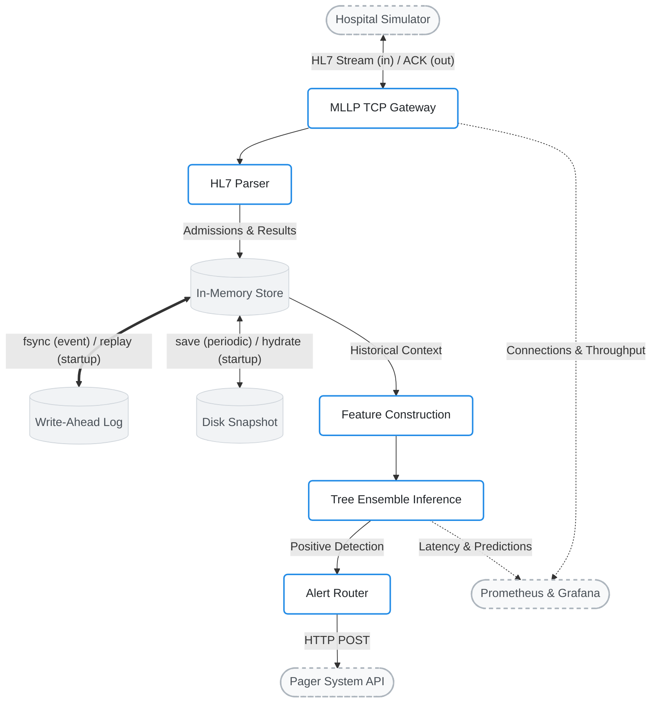

# AKIRIS: Real-Time AKI Inference Engine


**AKIRIS** is a resilient, low-latency machine learning pipeline designed to detect Acute Kidney Injury (AKI) from streaming hospital data.

Engineered to process raw HL7 healthcare messages over TCP/IP, AKIRIS utilizes an optimized gradient-boosted tree architecture to trigger asynchronous pager alerts, outperforming the standard NHS baseline algorithm while strictly optimizing for clinical safety (F3-score) and minimizing alert fatigue.

<picture>
  <source media="(prefers-color-scheme: dark)" srcset="misc/grafana_dashboard_dark.png">
  <source media="(prefers-color-scheme: light)" srcset="misc/grafana_dashboard_light.png">
  
</picture>

-----

## Architecture Overview

AKIRIS operates as a decoupled streaming architecture, isolating the predictive model from the network ingestion and state-management layers to ensure high throughput and fault tolerance.



-----

## Core Capabilities

  * **Low-Latency Inference:** Evaluates continuous `HL7` message streams via an MLLP TCP socket with a strictly enforced **p90 latency of \< 5ms** per prediction.
  * **Resilient State Management:** Implements a custom **Write-Ahead Log (WAL)** and snapshotting system to maintain patient physiological state in-memory, ensuring zero-data-loss recovery across container or pod restarts.
  * **Clinical Feature Engineering:** Maps raw creatinine streams to **KDIGO-compliant** rolling time-windows (48-hour and 7-day minimums) using causal, non-future-peeking expanding states.
  * **MLOps Pipeline:** Gradient-boosted ensembles are trained with dynamic class-weighting, threshold-optimized for the F3 metric via strictly partitioned longitudinal cross-validation (preventing patient-level data leakage), and wrapped in an isotonic regression calibrator to map raw log-odds back to true statistical risk.
  * **Unified Artifact Deployment:** The entire probability calibration wrapper and predictive ensemble are stitched into a single, unified computation graph, enabling dependency-free, cross-platform execution.
  * **Telemetry & Observability:** Native Prometheus instrumentation exporting real-time operational metrics (throughput, latency histograms, prediction rates) directly to auto-provisioned Grafana dashboards.
  * **Hospital Simulator:** Includes a deterministic, clinically-grounded data generator that simulates entire hospital wards (admissions, discharges, longitudinal blood tests).

-----

## Clinical Performance (ML vs. Baseline)

In live-streaming evaluations on an unseen 90-day cohort, AKIRIS was benchmarked against the standard rules-based NHS algorithm. By optimizing for the F3 score and utilizing KDIGO-compliant feature engineering, the ML engine achieved near-perfect classification.

| Metric                   | NHS Baseline | AKIRIS ML Engine | Clinical Impact                                                                                                            |
|:-------------------------|:-------------|:-----------------|:---------------------------------------------------------------------------------------------------------------------------|
| **Recall (Sensitivity)** | 91.9%        | **99.6%**        | AKIRIS successfully caught **19 additional patients** slipping into acute kidney failure.                                  |
| **False Negatives**      | 20           | **1**            | A highly robust safety net. Only 1 missed detection out of 9,510 total events.                                             |
| **Precision (PPV)**      | 97.4%        | **99.6%**        | **Reduced Alert Fatigue.** Eliminated 5 false positive pager alerts while simultaneously catching 19 more AKI predictions. |

-----

## Quick Start & Reproducibility

This project is designed to be fully reproducible. You can generate the synthetic cohorts, train the model, and run the real-time simulation entirely locally.

### 0\. Prerequisites

Ensure you have Python 3.12+ and Docker installed. It is highly recommended to use a virtual environment.

```bash
git clone https://github.com/teobenarous/akiris.git
cd akiris
python -m venv venv
source venv/bin/activate
pip install -r requirements.txt
```

### 1. Generate the Hospital Data

This pipeline builds two *completely independent* synthetic populations to ensure strict statistical partitioning between offline model training and real-time streaming evaluations.

* **Offline Training Cohort:** Simulates **2 years (730 days)** of longitudinal hospital activity across a population of **25,000 patients** (averaging 20 daily admissions). This dataset is automatically partitioned into an 80/20 stratified train/test split.
* **Live-Streaming Cohort:** Generates a completely isolated **90-day** continuous HL7v2 stream for a separate population of 25,000 patients, ensuring streaming metrics are not an artifact of data leakage or overfitting.

```bash
make all
```

*Outputs: `data/sample/train.csv`, `data/sample/test.csv`, and `data/sample/messages.mllp`, the live-stream payload.*

### 2\. Train and Export the Model

Train the gradient-boosting classifier, calibrate the probabilities, optimize the threshold, and export the unified binary computation graph.

```bash
python model/train.py
```

### 3\. Run the System

**Mode A: The Benchmark (Performance SLOs)**
Executes an automated stress test to validate system latency and clinical accuracy. This script provisions the local infrastructure, processes the unseen 90-day evaluation stream at maximum unthrottled throughput, generates the final performance report, and cleanly deprovisions the environment.

```bash
bash scripts/run_simulation.sh
```

**Mode B: The Showcase (Live Observability)**
Runs the stream in a rate-limited time-lapse mode (5 messages/sec). Open `http://localhost:3000` to watch the system process patients, trigger alerts, and track latency via Grafana in real-time.

```bash
docker-compose up --build -d
```

-----

## Testing & Reliability

AKIRIS maintains a rigorous testing suite. Because the system ingests streaming TCP sockets and manages volatile physiological state, the test suite heavily prioritizes fault injection, distributed systems recovery, and computational validations.

Execute the unified test pipeline:
```bash
bash scripts/run_tests.sh
```
*(This pipeline automatically handles `ruff` linting, `PYTHONPATH` resolution, and executes `pytest` with `--cov-report=term-missing`)*

### Verification Domains

* **Network Resilience & TCP Framing:** Validates byte-by-byte TCP fragmentation (`chunk_size=1`), out-of-band garbage data rejection, OS-level TCP Keep-Alive configurations, and MLLP start/end block parsing. 
* **Fault Tolerance & Circuit Breakers:** Simulates network disconnects during active streams to verify the application's connection retry loop. Enforces a 5-strike circuit breaker that triggers a clean `sys.exit(1)`, allowing Kubernetes to safely respawn the pod upon unrecoverable faults.
* **State Durability & Disk Corruption:** Tests the Write-Ahead Log (WAL) under catastrophic conditions, including `os.fsync` disk-full errors, malformed JSONL journal entries, and corrupted `.pkl` snapshots. Ensures the `PatientStore` bypasses corrupt bytes and recovers all valid data without crashing.
* **External API Integration:** Mocks the HTTP Pager API to verify that `4xx` client errors are cleanly dropped, while `5xx` server errors or network timeouts trigger exactly three retries using exponential backoff.
* **Clinical Feature Engineering:** Asserts that multi-day rolling KDIGO windows (48-hour and 7-day minimums), velocity, and volatility calculations strictly match expected clinical values. Verifies that extreme physiological outliers are securely clipped before entering the computation graph.
* **Performance SLOs & Clinical Validation:** End-to-end integration tests enforce a strict less than 30ms latency boundary per HL7 message. Furthermore, the test suite evaluates the synthetic cohorts against the legacy NHS rules-based algorithm, guaranteeing the generated data is clinically realistic enough for the baseline to achieve an F3-score greater than 0.70.

-----

## Repository Structure

```text
akiris/
├── app/                    # Core streaming inference engine
├── data/                   # Synthetic patient cohorts and live-stream MLLP payloads
├── k8s/                    # Kubernetes manifests and Prometheus/Grafana provisioning
├── model/                  # ML training pipeline and exported ONNX computation graph
├── scripts/                # Data generation, evaluation, and test orchestration
├── simulator/              # HL7/MLLP hospital streaming daemon
├── state/                  # Durability layer (Write-Ahead Log and Pickle snapshots)
├── tests/                  # Unit and integration test suite
├── docker-compose.yml      # Local observability showcase orchestration
├── Dockerfile              # Production multi-stage build for the inference engine
├── Makefile                # Data generation orchestration commands
└── requirements.txt        # Python dependencies
```